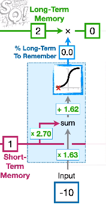
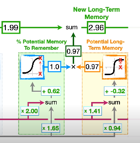
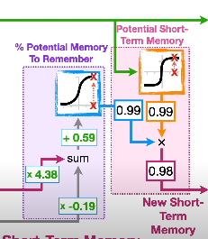

# linux-assignment-2
## Weather Forecasting using LSTM recurrent neural networks
This project leverages Long Short-Term Memory (LSTM) networks to predict weather conditions. The motivation for using LSTM arises from addressing the vanishing gradient problem inherent in traditional Recurrent Neural Networks (RNNs). The model was trained on a dataset comprising 20,000 observations and 8 parameters.

Forget gate which gives how much of ltm to be remembered.

input gate which gives new ltm to be remembered.

output gate which gives new stm to be remembered.

Through meticulous training over 100 epochs and data encoding, the model achieves accurate predictions, offering insights into various weather parameters, with a focus on providing precise rainfall measurements in centimeters. Explore the code and usage instructions to adapt the project to your specific forecasting needs.
